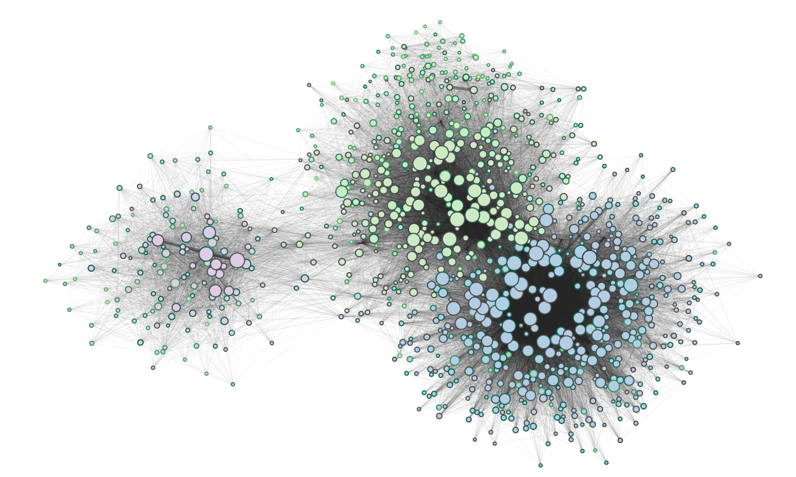

Pubmetric Documentation
#######################

This guide provides instructions for setting up and using the `pubmetric` package locally, including co-citation graph generation and the calculation of metrics.

Local Setup
***********

- Ensure you have Python 3.7+ installed.
- Download the repository on `GitHub`_.

.. _GitHub: https://github.com/Workflomics/workflomics-pubmetric

- Install the required Python packages listed in the `setup.py` file:

  .. code-block:: bash

     pip install setup.py

- For development purposes, include the test dependencies by running:

  .. code-block:: bash

     pip install .[test]

.. note:: The pubmetric co-citation graph can be visualised using Cytoscape. 
   To use Cytoscape, make sure you have it installed and open on your machine.

**Importing the Package**:

Import the necessary modules in your Python script, pubmetric relies on asyncio and needs to be executed using it:

.. code-block:: python 

   import pubmetric
   import asyncio

Graph Generation
*****************

**Generate New Co-citation Graph**

**Test Size**: Create a smaller co-citation graph for testing purposes:

.. code-block:: python

   testsize_graph = asyncio.run(pubmetric.network.create_network(test_size=20))

**Full Network**:

Generate a co-citation network for a specific topic:

.. code-block:: python

   full_proteomics_graph = asyncio.run(pubmetric.network.create_network(topic_id="topic_0121"))
   full_metabolomics_graph = asyncio.run(pubmetric.network.create_network(topic_id="topic_3172"))

Generate a genomics co-citation graph, using not the topic, but all well-annotated tools currently in bio.tools by specifying topic_id=None and tool_selection='full':

.. code-block:: python

   full_genomics_graph = asyncio.run(pubmetric.network.create_network(topic_id=None, tool_selection='full'))

Generate a co-citation network for a user-specifified list of tools, using a list of bio.tool tool names:

.. code-block:: python

   tool_pmid_list = ["tool_name_1", "tool_name_2", ...]
   graph_from_list = asyncio.run(pubmetric.network.create_network(topic_id=None, tool_selection=tool_pmid_list))

Pubmetric outputs three files; doi_pmid_library.json, tool_metadata.json and graph.pkl. These can be used to load the graph, or recreate the graph using the already downloaded metadata.

**Load Data**:

Load an existing co-citation graph from a specified path:

.. code-block:: python

   path_to_data = 'path/to/your/data/directory'
   loaded_graph = asyncio.run(pubmetric.network.create_network(inpath=path_to_data, load_graph=True))

.. note:: If load_graph=True is not specified, the graph will be regenerated using the metadata file in the specified directory.

**Graph visualisation**
Install and import Cytoscape for python (py4cytoscape) to interact with Cytoscape directly in your script:

.. code-block:: python 

   import py4cytoscape as p4c

When running the code, make sure the Cytoscape software is open:

.. code-block:: python
   
   p4c.create_network_from_igraph(graph, f"Cocitation_graph", collection="Bibliographic networks")

Below, an example of a merged co-citation graph containing tools from metabomics, proteomics and genomics is shown. 

**Figure:** Merged co-citation graph of the three domains genomics (blue, bottom right), metabolomics (pink/purple, left) and proteomics (green, top right). Illustrating shared tools and distributions of edge weights, ages, and degrees. The graph only includes nodes with a degree of 20 or higher, for clarity. Edge transparency and width correspond to the edge weight, with higher weights represented by thicker and more opaque lines. Node size corresponds to degree, with larger nodes indicating higher connectivity. Node border colour corresponds to tool age, where brighter green signifies newer tools and grey represents older ones. The inner colour of the nodes indicates the domain to which the tool belongs.

Metric Calculation
******************

**Download Workflow Data**:

To calculate the metric score the workflow must be loaded using `parse_cwl`. CWL files can be downloaded from the `Workflomics`_ live demo.
The CWL parser function needs `the tool_metadata.json` metadata file which is generated alongside the co-citation graph.
There are two main metrics, ``workflow_average`` and ``complete_average`` which take into account only the workflow 
edges, or all possible edges between tools in a workflow, respectively:

.. _Workflomics: http://145.38.190.48/

.. code-block:: python

   cwl_file_path = "./path/to/candidate_workflow.cwl"
   metadata_file_path = 'path/to/tool_metadata.json'
   workflow = pubmetric.workflows.parse_cwl(cwl_file_path, metadata_file_path)
   metric_score = pubmetric.metrics.workflow_average(loaded_graph, workflow)

File Schemas
************

This package requires files and data structures to adhere to specific schemas for proper operation. These are presented below. 

**The Metadata File:**

The metadata file holds the metadata also contained within the graph, with some additional global statistics on the data download. 
It can be used to regenerate a graph containing the tools in the file. By specifying inpath="./path/to/directory" containg the metadata file. 

.. code-block:: json

   {
      "creationDate": "string",
      "topic": "string",
      "totalNrTools": "number",
      "biotoolsWOpmid": "number",
      "pmidFromDoi": "number",
      "tools": [
         {
            "name": "string",
            "doi": "string or null",
            "topics": ["string"],
            "nrPublications": "number",
            "allPublications": ["string"],
            "pubDate": "number",
            "pmid": "string",
            "nrCitations": "number"
         }
      ]
   }

+-----+-----+-------------------+-----------+--------------------------------------------------------------------------------------------------------------+
|             Field             |  Required | Description                                                                                                  |
+=====+=====+===================+===========+==============================================================================================================+
|        ``creation_date``      |  No       | Date and time of file creation.                                                                              |
+-----+-----+-------------------+-----------+--------------------------------------------------------------------------------------------------------------+
|         ``topic``             |  No       | The topic for which the graph was generated, or None if the full bio.tools or a selection was used.          |
+-----+-----+-------------------+-----------+--------------------------------------------------------------------------------------------------------------+
|     ``total_nr_tools``        |  No       | The total nr of tools in bio.tools (or for the topic, if specified).                                         |
+-----+-----+-------------------+-----------+--------------------------------------------------------------------------------------------------------------+
|     ``biotools_wo_pmid``      |  No       | The number of tools that dont have a Pubmed ID in bio.tools .                                                |
+-----+-----+-------------------+-----------+--------------------------------------------------------------------------------------------------------------+
|     ``pmid_from_doi``         |  No       | Number of tool Pubmed IDs downloaded from NCBI using their DOI.                                              |
+-----+-----+-------------------+-----------+--------------------------------------------------------------------------------------------------------------+
|     ``tools``                 |  Yes      | A list of the tools for which Pubmed IDs were found, and their metadata.                                     |
+-----+-----+-------------------+-----------+--------------------------------------------------------------------------------------------------------------+
|     ``name``                  |  Yes      | The tool name as registered in bio.tools.                                                                    |
+-----+-----+-------------------+-----------+--------------------------------------------------------------------------------------------------------------+
|     ``doi``                   |  No       | The DOI for the primary publication of the tool.                                                             |
+-----+-----+-------------------+-----------+--------------------------------------------------------------------------------------------------------------+
|     ``topics``                | No        | The topics linked to the tool in bio.tools.                                                                  |
+-----+-----+-------------------+-----------+--------------------------------------------------------------------------------------------------------------+
|     ``nr_publications``       | No        | The number of publications linked to (presenting) the tool.                                                  |
+-----+-----+-------------------+-----------+--------------------------------------------------------------------------------------------------------------+
|     ``all_publications``      | No        | The Pubmed IDs of publications linked to (presenting) the tool.                                              |
+-----+-----+-------------------+-----------+--------------------------------------------------------------------------------------------------------------+
|     ``publication_date``      | Yes       | The year the primary publication was published                                                               |
+-----+-----+-------------------+-----------+--------------------------------------------------------------------------------------------------------------+
|     ``pmid``                  | Yes       | The Pubmed ID for the primary publication of the tool.                                                       |
+-----+-----+-------------------+-----------+--------------------------------------------------------------------------------------------------------------+
|     ``nr_citations``          |  No       | The number of citations the primary publication of the tool, downloaded from EuropePMC.                      |
+-----+-----+-------------------+-----------+--------------------------------------------------------------------------------------------------------------+

**The Graph:**

Each vertex in the co-citation graph represents a software tool in bio.tools. Each edge represents the number of co-citations between a pair of tools. 
The edges and vertices contain additional metadata which is used in the calculation of the metrics. 

+-----+-----+-------------------+-----------+-------------------------------------------------------------------------------------------------------------------+
|             Field             | Attribute | Description                                                                                                       |
|                               |  Level    |                                                                                                                   |
+=====+=====+===================+===========+===================================================================================================================+
|        ``creation_date``      |  Graph    | Date and time of file creation.                                                                                   |
+-----+-----+-------------------+-----------+-------------------------------------------------------------------------------------------------------------------+
|         ``topic``             |  Graph    | The topic for which the graph was generated, or None if the full bio.tools or a selection was used.               |
+-----+-----+-------------------+-----------+-------------------------------------------------------------------------------------------------------------------+
|     ``tool_selection``        |  Graph    | A boolean for if the graph was created using a list of selected tools rather than a topic.                        |
+-----+-----+-------------------+-----------+-------------------------------------------------------------------------------------------------------------------+
|    ``graph_creation_time``    |  Graph    | The total time taken for the data download and graph creation.                                                    |
+-----+-----+-------------------+-----------+-------------------------------------------------------------------------------------------------------------------+
|         ``name``              |  Vertex   | The tool name, as registered in bio.tools, of the tool represented by the vertex.                                 |
+-----+-----+-------------------+-----------+-------------------------------------------------------------------------------------------------------------------+
|     ``pmid``                  |  Vertex   | The Pubmed ID for the primary publication of the tool represented by the vertex.                                  |
+-----+-----+-------------------+-----------+-------------------------------------------------------------------------------------------------------------------+
|        ``age``                |  Vertex   | Time since publication of the primary publication for the tool represented by the vertex.                         |
+-----+-----+-------------------+-----------+-------------------------------------------------------------------------------------------------------------------+
|         ``nr_citations``      |  Vertex   | The number of citations the primary publication of the tool, downloaded from EuropePMC.                           |
+-----+-----+-------------------+-----------+-------------------------------------------------------------------------------------------------------------------+
|         ``degree``            |  Vertex   | The number of edges connected to the vertex.                                                                      |
+-----+-----+-------------------+-----------+-------------------------------------------------------------------------------------------------------------------+
|     ``weight``                |  Edge     | The number of co-citations between a certain pair of tools.                                                       |
+-----+-----+-------------------+-----------+-------------------------------------------------------------------------------------------------------------------+
|     ``inverted_weight``       |  Edge     | The closeness of a pair of tools (inverted number of co-citations between a certain pair of tools.)               |
+-----+-----+-------------------+-----------+-------------------------------------------------------------------------------------------------------------------+

**The Workflow Dictionary**

The workflow dictionary, which is generated using ``parse_cwl``, follows the following schema:

.. code-block:: json

   {
       "edges": [
           [
               "string",
               "string"
           ]
       ],
       "steps": {
           "string": "string"
       },
       "pmid_edges": [
           [
               "string",
               "string"
           ]
       ]
   }

+-----+-----+-------------------+-----------+-------------------------------------------------------------------------------------------------------------------+
|             Field             |  Required | Description                                                                                                       |
+=====+=====+===================+===========+===================================================================================================================+
|        ``edges``              |  Yes      | Tuples of step names, as given by the APE generated CWL file. Allows for repetition of tools through step indexing|
+-----+-----+-------------------+-----------+-------------------------------------------------------------------------------------------------------------------+
|         ``steps``             |  Yes      | A dictionary which links each step name to its Pubmed ID.                                                         |
+-----+-----+-------------------+-----------+-------------------------------------------------------------------------------------------------------------------+
|     ``pmid_edges``            |  Yes      | Tuples of Pubmed IDs. Often extracted by metrics which do not require the worfklow order to be perserved.         |
|                               |           | OBS this does not reflect potential repetition of tools, but treats each occurance of a tool as a single node.    |
+-----+-----+-------------------+-----------+-------------------------------------------------------------------------------------------------------------------+
