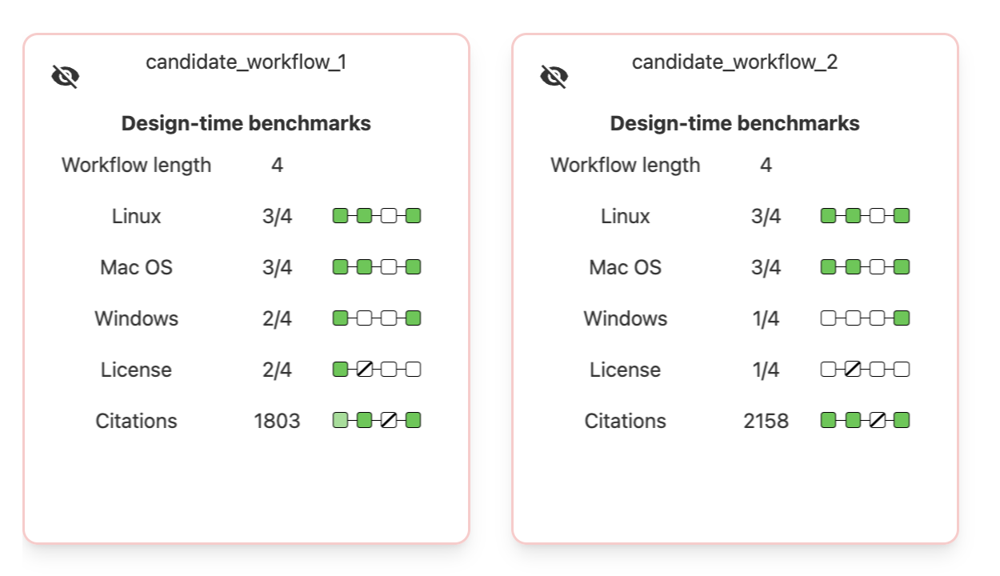
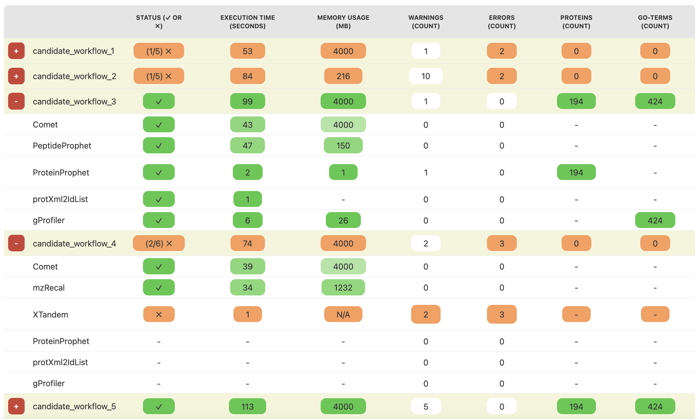
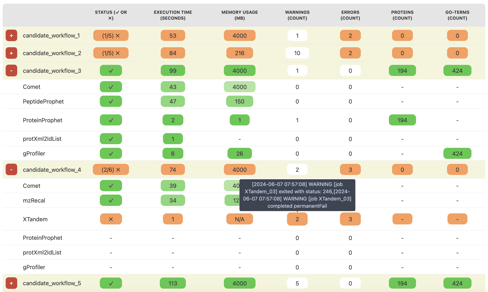

###################################
Data Formats and Schemas Overview
###################################

This page provides an overview of the various data formats and schemas used within our project. 

**************************
JSON Schema for Benchmarks
**************************

The json structure is used to capture detailed benchmark results, which include both design-time and run-time metrics. Each benchmark is detailed at the tool level and aggregated at the workflow level. The benchmarks are used to guide users in selecting the most suitable workflow for their needs and to provide detailed information about the execution of the workflow.

The benchmarks are computed at two levels: design-time and run-time. The design-time benchmarks are computed based on metadata such as the number of citations, supported operating systems, and license types. The run-time benchmarks are computed based on execution details such as execution time, memory usage, and the number of identified proteins and GO-terms. They use the same structure, however they are visualized differently to provide the user with the most relevant information at each stage.

JSON Schemas
============

.. code-block::

    [
        {
            "workflow_name": "string",
            "executor": "string",
            "runID": "string",
            "inputs": [
                {   
                    "cwl_id": "string",
                    "filename": "string",
                    "size": "number"
                }
    ],
            "benchmarks": [
                {
                    "description": "string",
                    "title": "string",
                    "unit": "string",
                    "aggregate_value": {
                        "value": "string|number",
                        "desirability": "number"
                    },
                    "steps": [
                        {
                            "tool_name": "string",
                            "label": "string",
                            "value": "string|number",
                            "desirability": "number",
                            "tooltip": ["string"]
                        }
                    ]
                }
            ]
        }
    ]

.. .. image:: images/run_time_example.png
..    :alt: Run-Time Benchmark Visualization

**Field Descriptions:**

+-----+-----+---------------------+----------+-----------------------------------------------+
|             Field               | Required | Description                                   |
+=====+=====+=====================+==========+===============================================+
|             ``workflow_name``   | Yes      | The name of the workflow.                     |
+-----+-----+---------------------+----------+-----------------------------------------------+
|             ``executor``        | No       | The executor used for the run.                |
+-----+-----+---------------------+----------+-----------------------------------------------+
|             ``runID``           | No       | A unique identifier for the run.              |
+-----+-----+---------------------+----------+-----------------------------------------------+
|             ``inputs``          | No       | An array of input objects.                    |
+-----+-----+---------------------+----------+-----------------------------------------------+
|     |       ``cwl_id``          | No       | The CWL identifier for the input.             |
+-----+-----+---------------------+----------+-----------------------------------------------+
|     |       ``filename``        | No       | The name of the input file.                   |
+-----+-----+---------------------+----------+-----------------------------------------------+
|     |       ``size``            | No       | The size of the input file.                   |
+-----+-----+---------------------+----------+-----------------------------------------------+
|             ``benchmarks``      | Yes      | An array of benchmark objects.                |
+-----+-----+---------------------+----------+-----------------------------------------------+
|     |       ``description``     | Yes      | A description of the benchmark.               |
+-----+-----+---------------------+----------+-----------------------------------------------+
|     |       ``title``           | Yes      | The title of the benchmark.                   |
+-----+-----+---------------------+----------+-----------------------------------------------+
|     |       ``unit``            | Yes      | The unit of the benchmark.                    |
+-----+-----+---------------------+----------+-----------------------------------------------+
|     |       ``aggregate_value`` | Yes      | Aggregated value for the benchmark.           |
+-----+-----+---------------------+----------+-----------------------------------------------+
|     |     | ``value``           | Yes      | The aggregated value.                         |
+-----+-----+---------------------+----------+-----------------------------------------------+
|     |     | ``desirability``    | Yes      | Aggregated desirability score (-1 to 1).      |
+-----+-----+---------------------+----------+-----------------------------------------------+
|     |       ``steps``           | Yes      | An array of step objects detailing each tool. |
+-----+-----+---------------------+----------+-----------------------------------------------+
|     |     | ``tool_name``       | Yes      | The name of the tool.                         |
+-----+-----+---------------------+----------+-----------------------------------------------+
|     |     | ``value``           | Yes      | The computed value for the benchmark step.    |
+-----+-----+---------------------+----------+-----------------------------------------------+
|     |     | ``label``           | Yes      | A human readable benchmark value.             |
+-----+-----+---------------------+----------+-----------------------------------------------+
|     |     | ``desirability``    | Yes      | A score indicating desirability (-1 to 1).    |
+-----+-----+---------------------+----------+-----------------------------------------------+
|     |     | ``tooltip``         | No       | Additional details for the step.              |
+-----+-----+---------------------+----------+-----------------------------------------------+

Note that run-time benchmark schema extends the design-time schema with additional fields for execution details.

Visualization
-------------

The design-time and run-time benchmarks are using different visualizations. The **design-time benchmarks** are intended to give a quick overview of the workflow, and guide the user to the most suitable workflow to be executed and further analyzed. Therefore we display workflow steps as a graphical elements where their color and tooltip depict the benchmark values. An example of such visualization is shown below.

In this visualization, each benchmark from the ``benchmarks`` array is shown as a separate row. The ``title`` of each benchmark serves as the row label, and the ``description`` appears as its tooltip. The ``aggregate_value`` is displayed next to the label without additional formatting.

Each benchmark's workflow tools are listed in the ``steps`` array, represented by individual squares. The ``value`` of each tool is its tooltip, and the ``desirability`` determines its color. Desirability is a score ranging from -1 to 1:

- -1 (least desirable) is depicted in red.
- 0 (neutral) is depicted in white.
- 1 (most desirable) is depicted in green.

For scores that are not whole numbers, the color is shown as a gradient between the respective colors. In our example, all desirability scores fall between 0 and 1, using only the gradient from white to green.

.. note::
   Benchmark information for some tools might not be available. In such cases, the ``value`` is set to ``"Unknown"`` (see tool ``protXml2IdList`` in the following example) and the ``desirability`` is (usually) set to 0. Such boxes are visualized as crossed out to indicate that the data is ``Unknown`` (the keyword is case sensitive).

To illustrate, this is a snippet of the JSON structure that corresponds to the first (``candidate_workflow_1``) visualization above:

.. code-block::

    {
    "workflow_name": "candidate_workflow_1",
    "runID": "368028d5e31722431463105",
    "benchmarks": [
        ...
        {
            "unit": "citation count",
            "description": "Citations annotated per tool",
            "title": "Citations",
            "steps": [
                {
                    "desirability": 0.8,
                    "tool_name": "Comet",
                    "value": "718",
                    "label": "718"
                },
                {
                    "desirability": 1,
                    "tool_name": "ProteinProphet",
                    "value": "2888",
                    "label": "2888"
                },
                {
                    "desirability": 0,
                    "tool_name": "protXml2IdList",
                    "value": "0",
                    "label": "Unknown"
                },
                {
                    "desirability": 1,
                    "tool_name": "gProfiler",
                    "value": "3460",
                    "label": "3460"
                }
            ],
            "aggregate_value": {
                "desirability": 1,
                "value": "1803"
            }
        },
        ...
        ]
    }

The **run-time benchmarks** are intended to give a detailed overview of the execution of the workflow. Therefore we display the benchmark values in a table, where the rows represent the tools and the columns represent the benchmark values. An example of such visualization is shown below.

In this visualization, each benchmark from the ``benchmarks`` array is shown as a separate column. The ``title`` of each benchmark serves as the column label, together with the ``unit``. The rows are nested, with the first level representing the whole workflow and the second level representing the tools. 

On the first level, the workflow is represented by a single row, with the ``workflow_name`` as the label. The ``aggregate_value`` is displayed in the respective column and the ``desirability`` determines its color. Desirability is a score ranging from -1 to 1 (as described above).

On the second level, each tool is represented by a row, with the ``label`` as the label. The ``value`` is displayed in the respective column and the ``desirability`` determines the cell color. Desirability is a score ranging from -1 to 1 (as described above).

.. note::
   We generally prefer to use desirability scores from 0 to 1 or -1 to 0, as each benchmark often has a "good" or "bad" and a neutral side. In some rare cases, we include -1 to indicate, for example, that a step has failed. For instance, in the `candidate_workflow_4`, execution times are usually between 0 and 1. However, if a tool fails, it would be colored red to alert the user that the value was not retrieved due to a failed execution.

The ``tooltip`` field is used to provide additional information about the benchmark value. In the following example, the tooltip for the cell that represents the number of warnings is the list of warnings that were generated during the execution of the tool.

The following JSON structure corresponds to the ``candidate_workflow_4`` workflow visualization above:

.. code-block::

    {
      "workflowName": "candidate_workflow_4",
      "executor": "cwltool 3.1.20240508115724",
      "runID": "39eddf71ea1700672984653",
      "inputs": {
         "input_1": {
            "filename": "EH10654.mzML"
         },
         "input_2": {
            "filename": "UP000005640_9606.fasta"
         }
      },
      "benchmarks": [
         {
            "description": "Status for each step in the workflow",
            "title": "Status",
            "unit": "\u2713 or \u2717",
            "aggregate_value": {
               "value": "(2/6) \u2717",
               "desirability": -1
            },
            "steps": [
               {
                  "tool_name": "Comet",
                  "label": "\u2713",
                  "value": "pass",
                  "desirability": 1
               },
               {
                  "tool_name": "mzRecal",
                  "label": "\u2713",
                  "value": "pass",
                  "desirability": 1
               },
               {
                  "tool_name": "XTandem",
                  "label": "\u2717",
                  "value": "fail",
                  "desirability": -1
               },
               {
                  "tool_name": "ProteinProphet",
                  "label": "-",
                  "value": "-",
                  "desirability": 0
               },
               {
                  "tool_name": "Comet",
                  "label": "-",
                  "value": "-",
                  "desirability": 0
               },
               {
                  "tool_name": "Comet",
                  "label": "-",
                  "value": "-",
                  "desirability": 0
               }
            ]
         },
         {
            "description": "Execution time for each step in the workflow",
            "title": "Execution time",
            "unit": "seconds",
            "aggregate_value": {
               "value": 74,
               "desirability": -1
            },
            "steps": [
               {
                  "tool_name": "Comet",
                  "label": "Comet",
                  "value": 39,
                  "desirability": 0.7
               },
               {
                  "tool_name": "mzRecal",
                  "label": "mzRecal",
                  "value": 34,
                  "desirability": 0.7
               },
               {
                  "tool_name": "XTandem",
                  "label": "XTandem",
                  "value": 1,
                  "desirability": -1
               },
               {
                  "tool_name": "ProteinProphet",
                  "label": "ProteinProphet",
                  "value": "-",
                  "desirability": 0
                  
               },
               {
                  "tool_name": "protXml2IdList",
                  "label": "protXml2IdList",
                  "value": "-",
                  "desirability": 0
               },
               {
                  "tool_name": "gProfiler",
                  "label": "gProfiler",
                  "value": "-",
                  "desirability": 0
               }
            ]
         },
         ...
      ]
   }

Notice that the status icons are explicitly provided in the JSON file as Unicode characters. The check mark (✔, ``\u2713``) is used to indicate that the tool has successfully executed, while the cross (✘, ``\u2717``) is used to indicate that the tool has failed. The dash (-) is used to indicate that the tool has not been executed.

Other Formats
=============
In addition to the JSON formats described above, we use other data formats such as APE-specific domain annotations within the project. These formats are either described externally and referenced or will be added to this document in the future.

