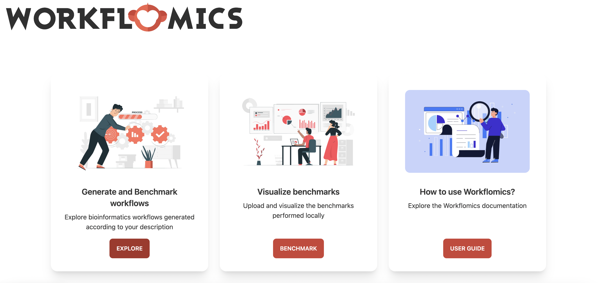
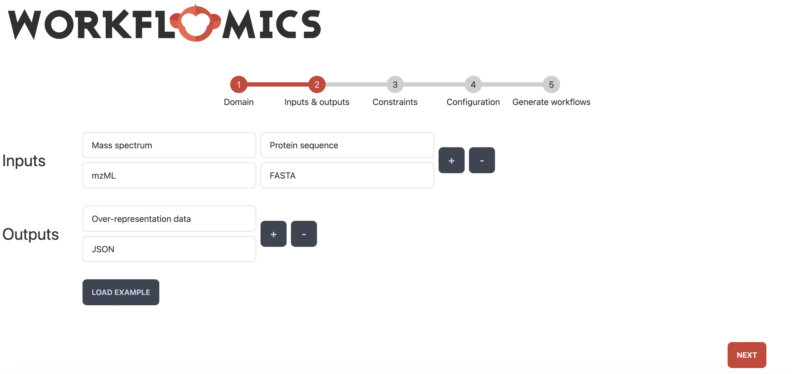
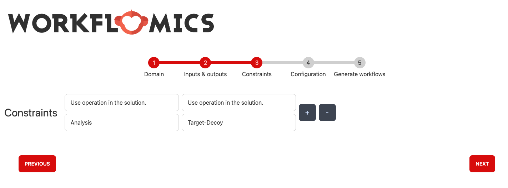
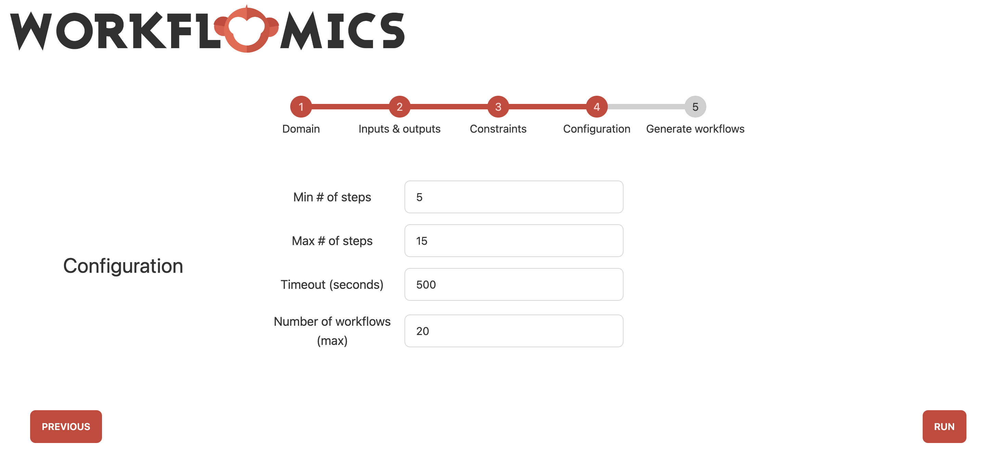
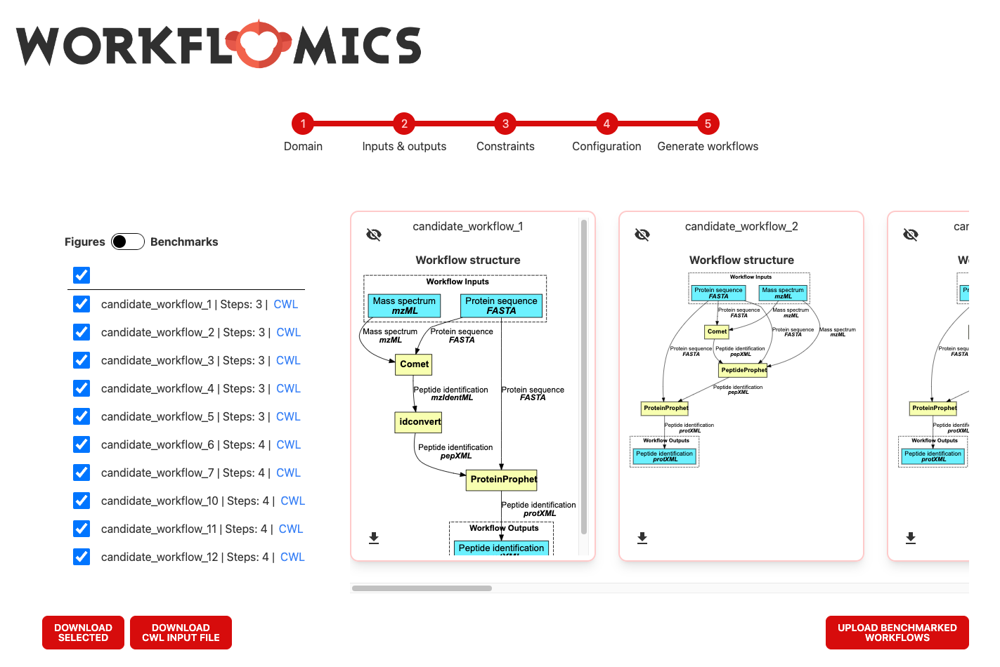
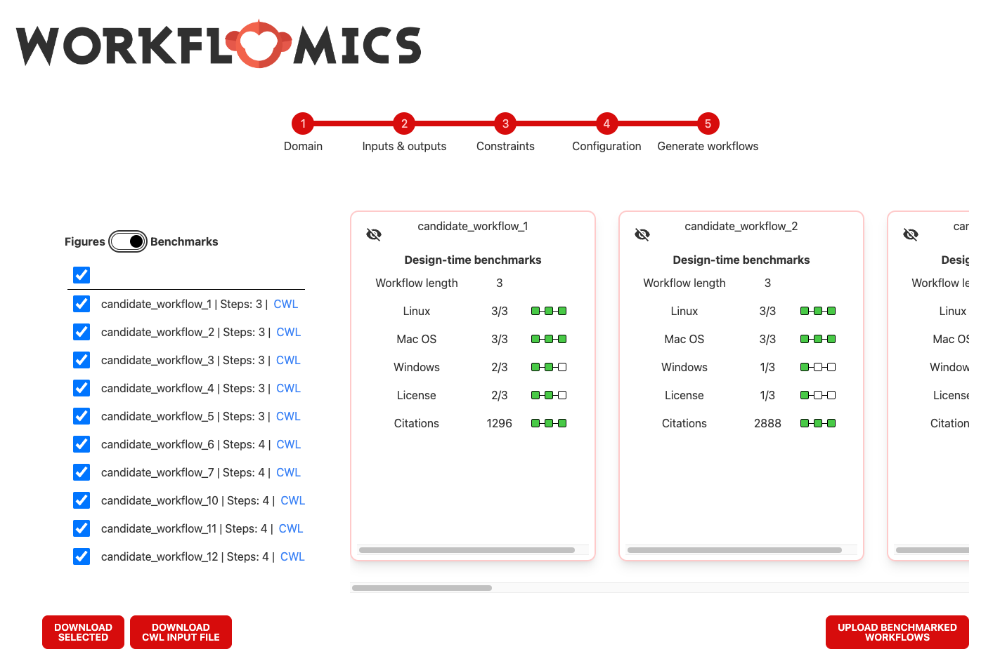
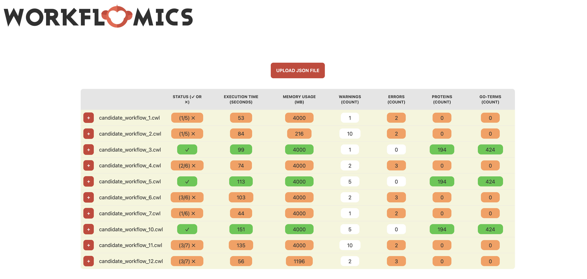
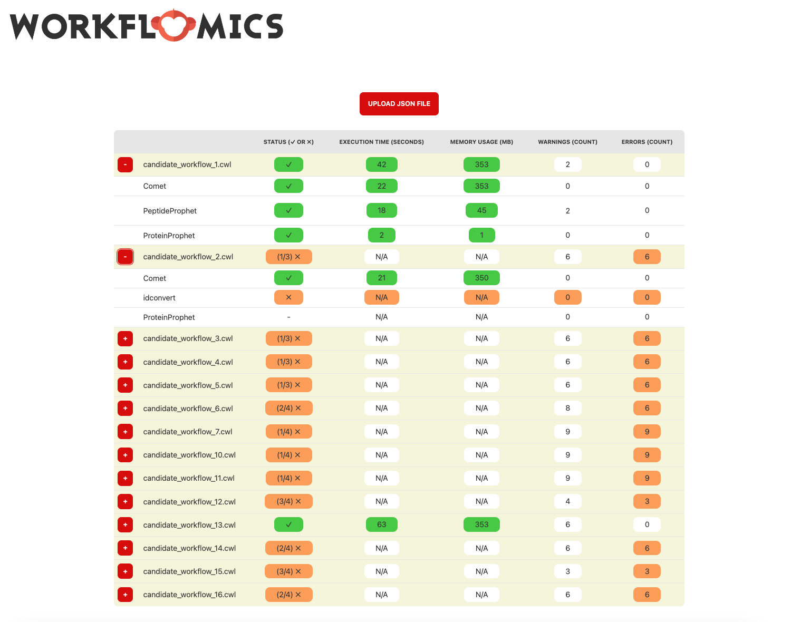

Web Interface
=============

This section guides you through the process of utilizing Workflomics, from accessing the platform to generating and benchmarking workflows. Workflomics offers an intuitive web interface that enables users to efficiently create, compare, and optimize computational workflows for bioinformatics research.

Accessing Workflomics
---------------------

To begin exploring the capabilities of Workflomics, visit the live demo:

- **Live Demo**: `Workflomics Live Demo <http://145.38.190.48/>`_

Here, you will find a user-friendly interface designed to facilitate the generation of workflows tailored to your research needs.

Generate Workflows
------------------

Generating workflows with Workflomics involves several key steps, each designed to ensure that the workflows you create are optimally configured for your specific data analysis requirements.

Explore
~~~~~~~

The first step in generating workflows is choose "Explore" from the home menu. This will take you to the workflow generation interface, where you can specify the domain of your research and the desired inputs and outputs.

   Home page of the Workflomics web interface. The "Explore" option allows you to specify the domain of your research and the desired inputs and outputs.

Choose the Domain
~~~~~~~~~~~~~~~~~

The first step in generating workflows is to select the domain of your research. Workflomics currently supports only the proteomics domain. By specifying the domain, you can focus the workflow generation process on the most relevant tools and methods for your research.

.. figure:: ./screenshots/domain.png
   :align: center
   :alt: Domain selection

   Web interface for choosing the domain of your research. Workflomics currently supports only the proteomics domain.

Choose Workflow Inputs and Outputs
~~~~~~~~~~~~~~~~~~~~~~~~~~~~~~~~~~~

Before generating workflows, you must specify the desired inputs and outputs. This initial step is crucial as it defines the scope and objectives of the computational task. Example inputs Mass spectrum in mzML format, and Protein sequence in FASTA format. Output: any type of data in protXML format.

   Web interface for specifying the available workflow inputs and desired workflow outputs. Each input and output is specified as a pair of data type and format (using EDAM Ontology terms). The example specifies two inputs, a "Mass spectrum in mzML format" and a "Protein sequence in FASTA format", and the desired output as "any type of data in protXML format".

Specify Constraints
~~~~~~~~~~~~~~~~~~~

Constraints allow you to narrow down the search for workflows by setting specific requirements, such as computational resources, runtime, or data formats.

   Web interface for specifying constraints on the workflow generation process. Constraints currently allow enforcing (or excluding) specific types of operations or tools in the workflow. The example enforces the inclusion of at least one tool that performs "Analysis" and at least one tool that performs "Target-Decoy".

Specify Search Parameters
~~~~~~~~~~~~~~~~~~~~~~~~~

Adjusting search parameters enables you to fine-tune the workflow generation process, influencing how Workflomics explores the vast space of possible workflows.

   Web interface for specifying search parameters for the workflow generation process. These parameters influence how Workflomics explores the space of possible workflows. The parameters include the maximum number of steps in the workflow, the runtime, and the number of workflows to generate.

Explore Generated Workflows
~~~~~~~~~~~~~~~~~~~~~~~~~~~

Once you have specified the domain, inputs, outputs, constraints, and search parameters, Workflomics will generate a list of candidate workflows that meet your criteria. You can then explore these workflows to identify the most promising options for your research.

   Web interface for exploring the candidate workflows generated by Workflomics. Each workflow is presented as a directed acyclic graph (DAG) that visualizes the sequence of operations and tools involved, rectangles represent the tools and the arrows represent the data flow between them. You can click on each workflow and download it as a CWL file for further evaluation and execution.

In addition to visualizing the workflows, a design-time analysis of each workflow is also provided. This analysis includes the number of steps, and quality metrics for each tool, such as the number of citations, license openness, and OS compatibility.

   Web interface for exploring the candidate workflows generated by Workflomics. Each workflow is presented with a design-time benchmarks that includes the number of steps, and quality metrics for each tool, such as the number of citations, license openness, and OS compatibility.

.. note:: You can toggle between the visual representation of the workflow and the design-time benchmarks by clicking the toggle button at the top left of the interface. 

Pick Candidate Workflows and Run Them Locally
~~~~~~~~~~~~~~~~~~~~~~~~~~~~~~~~~~~~~~~~~~~~~~

After Workflomics has generated a list of candidate workflows, the next step is to evaluate these workflows to determine which ones best meet your research objectives. This involves selecting promising workflows based on the criteria you've set and running them on your local machine. This process allows you to assess the performance and effectiveness of each workflow with your own datasets, ensuring that you choose the most suitable option for your specific needs.

- **Selecting Workflows**: Review the list of candidate workflows generated by Workflomics. Consider factors such as the workflow's complexity, the computational resources required, and its compatibility with your data.
- **Running Locally**: Execute the selected workflows locally to test their performance. This hands-on evaluation is crucial for understanding how the workflow operates with real data and identifying any necessary adjustments.

For detailed instructions on how to benchmark workflows locally, including setting up your environment and running the benchmarking tool, please refer to the dedicated section in our documentation:

- **Benchmarking Workflows Locally**: See the `Workflomics Benchmarker <https://workflomics.readthedocs.io/en/latest/benchmarker.html/>`_ for comprehensive guidelines on local benchmarking practices. This document provides step-by-step instructions to help you effectively evaluate the candidate workflows on your system.

This step is essential for ensuring that the workflows you choose are not only theoretically sound but also practically viable for your research projects.

Upload Benchmark Results
------------------------

After executing and analyzing the workflows, uploading the benchmark results to Workflomics not only facilitates the comparison of efficiency and effectiveness across different workflow configurations but also unlocks the potential for visual analytics. This step is pivotal in harnessing the collective intelligence of the Workflomics community to refine and enhance bioinformatics workflows.

Steps for Uploading Benchmark Results
~~~~~~~~~~~~~~~~~~~~~~~~~~~~~~~~~~~~~

1. **Navigate to the Upload Interface**: Access the Workflomics upload page dedicated to benchmark results at `Workflomics Benchmarks Upload <http://145.38.190.48/benchmarks>`_. This platform is designed to be intuitive, ensuring a seamless upload process.

2. **Prepare Your Benchmark Data**: Ensure your `workflow-benchmarks.json` file is ready for upload. This file should contain all relevant data from your benchmarking session.

3. **Upload and Visualize**: Follow the on-screen instructions to upload your benchmark results. Upon successful upload, you will gain access to Workflomics' advanced visualization tools, enabling you to analyze and interpret your data in a highly interactive and insightful manner.

   Web interface for uploading benchmark results to Workflomics. Upon successful upload, you will gain access to Workflomics' tablular visualization of the benchmark results, enabling you to compare the performance of different workflows.

Each workflow benchmark result is presented as a row in the table, with columns representing individual benchmarks. The workflows can be further expanded to reveal detailed information about the tools and operations involved.

   The workflows can be further expanded to reveal detailed information about the tools and operations involved. In the example, candidate workflows 1 and 2 are expanded to show the information about each tool and operation involved in the workflow. We can see that all the tools in the first workflow are executed successfully, while the second workflow has failed to execute the second tool "idconvert".

Conclusion
----------

Leveraging Workflomics to its fullest extends far beyond merely generating and running workflows. By actively participating in the benchmarking and results-sharing process, you contribute to a broader endeavor aimed at optimizing bioinformatics workflows. This collective effort not only accelerates scientific discovery but also promotes the reproducibility and robustness of research findings.

The forthcoming additions of detailed guides and visual aids will further empower you to navigate through each phase of the workflow generation, benchmarking, and results analysis process with ease. Stay engaged with the Workflomics community to enhance your research capabilities and contribute to the advancement of bioinformatics.

Remember, your insights and contributions are invaluable in building a repository of knowledge that benefits the entire field of bioinformatics, driving forward the quest for scientific excellence and innovation.
