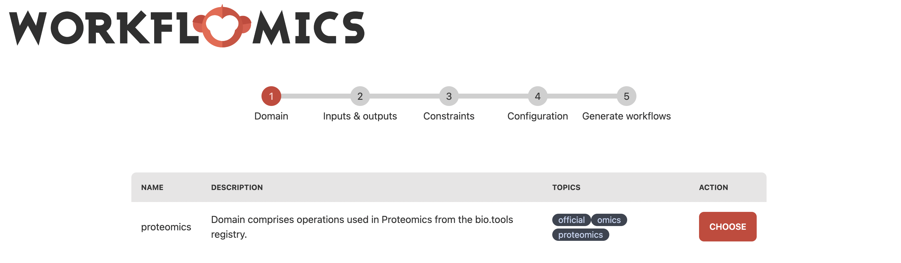
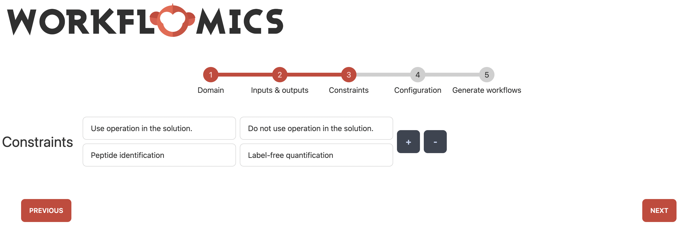
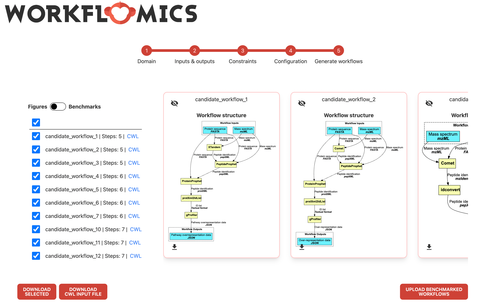
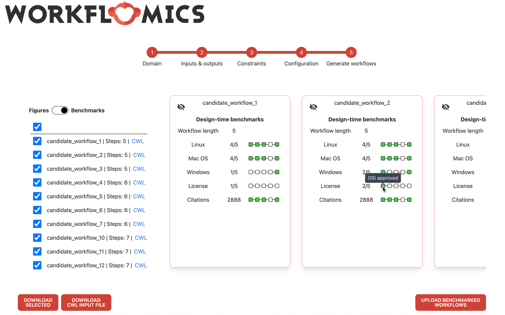
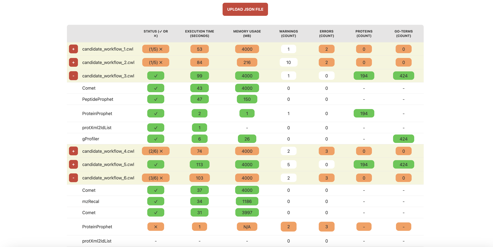

#############
Web Interface
#############

This section guides you through the process of using Workflomics, from accessing the platform to generating and benchmarking workflows. Workflomics offers an intuitive web interface that enables users to efficiently create, compare, and optimize computational workflows for bioinformatics research.

Accessing Workflomics
*********************

To begin exploring the capabilities of Workflomics, visit the live demo:

- ##Live Demo##: `Workflomics Live Demo <http://145.38.190.48/>`_

Here, you will find a user-friendly interface designed to facilitate the generation of workflows tailored to your research needs.

Generate Workflows
******************

Generating workflows with Workflomics involves several key steps, each designed to ensure that the workflows you create are optimally configured for your specific data analysis requirements.

Explore
=======

The first step in generating workflows is choose "Explore" from the home menu. This will take you to the workflow generation interface, where you can specify the domain of your research and the desired inputs and outputs.

   Home page of the Workflomics web interface. 

The "Explore" option allows you to specify the domain of your research and the desired inputs and outputs.

Choose the Domain
=================

The first step in generating workflows is to select the domain of your research. Workflomics currently supports only the proteomics domain. By specifying the domain, you can focus the workflow generation process on the most relevant tools and methods for your research.

   Web interface for choosing the domain of your research. Workflomics currently supports only the proteomics domain.

Choose Workflow Inputs and Outputs
===================================

Before generating workflows, you must specify the desired inputs and outputs. This initial step is crucial as it defines the scope and objectives of the computational task. Example inputs Mass spectrum in mzML format, and Protein sequence in FASTA format. Output: any type of data in protXML format.

   Web interface for specifying the available workflow inputs and desired workflow outputs. 

Each input and output is specified as a pair of data type and format (using EDAM Ontology terms). The example specifies two inputs, a "Mass spectrum in mzML format" and a "Protein sequence in FASTA format", and the desired output as "any type of data in protXML format".

Specify Constraints
===================

Constraints allow you to narrow down the search for workflows by setting specific requirements, such as computational resources, runtime, or data formats.

   Web interface for specifying constraints on the workflow generation process. 

Constraints currently allow enforcing (or excluding) specific types of operations or tools in the workflow. The example enforces the inclusion of at least one tool that performs "Analysis" and at least one tool that performs "Target-Decoy".

Specify Search Parameters
=========================

Adjusting search parameters enables you to fine-tune the workflow generation process, influencing how Workflomics explores the vast space of possible workflows.

.. figure:: ./screenshots/config.png
   :align: center
   :alt: Workflow generation parameters

   Web interface for specifying search parameters for the workflow generation process. 

The parameters influence how Workflomics explores the space of possible workflows. The parameters include the maximum number of steps in the workflow, the runtime, and the number of workflows to generate.

Explore Generated Workflows
===========================

Once you have specified the domain, inputs, outputs, constraints, and search parameters, Workflomics will generate a list of candidate workflows that meet your criteria. You can then explore these workflows to identify the most promising options for your research.

Workflow structure
------------------

   Web interface for exploring the candidate workflows generated by Workflomics. 
   
Each workflow is presented as a directed acyclic graph (DAG) that visualizes the sequence of operations and tools involved, rectangles represent the tools and the arrows represent the data flow between them. You can click on each workflow and download it as a CWL file for further evaluation and execution.

Design-time benchmarks
----------------------

In addition to visualizing the workflows, a design-time analysis of each workflow is also provided. This analysis includes the number of steps, and quality metrics for each tool, such as the number of citations, license openness, and OS compatibility.

   Web interface for visualising design-time benchmarks of the candidate workflows.

Each workflow contains a design-time benchmarks that provide information about the quality of the tools used in the workflow. The design-time benchmarks are obtained from the bio.tools and OpenEBench APIs, and include the following:

- ##OS Compatibility##: Understanding tool compatibility with different operating systems (Linux, macOS, MS Windows) is crucial for users who require their pipelines to run directly on designated machines with accessible tools. While containerized environments can mitigate compatibility issues, direct compatibility remains essential for certain scenarios due to performance or specific use-case requirements. The OS compatibility, obtained from bio.tools, is provided on the tool level and aggregated by the count of tools that support each operating system.
- ##License##: The openness of the software license is a crucial factor in selecting tools for workflows. Open-source tools are generally preferred due to their transparency, allowing users to inspect and verify code for security and integrity, customizability, and community support. Licenses can be OSI-approved, open, closed, or unknown. License information, provided on the tool level and aggregated by the count of open licenses, is sourced from OpenEBench.
- ##Citations##: The number of citations for software is a potential indicator of the tool's reliability and community support. While the number of citations alone does not guarantee quality, especially in rapidly evolving fields where newer tools may not have accumulated as many citations as older ones, tools with a higher number of citations are often considered more reliable and widely used. The number of citations, obtained from OpenEBench, is presented at the tool level and as the median per workflow. The median is used to account for outliers and provide a more representative measure of citations across the workflow. More sophisticated metrics, such as tool co-citations, are part of ongoing work.

.. note:: You can toggle between the visual representation of the workflow and the design-time benchmarks by clicking the toggle button at the top left of the interface. 

Pick Candidate Workflows and Run Them Locally
==============================================

After Workflomics has generated a list of candidate workflows, the next step is to evaluate these workflows to determine which ones best meet your research objectives. This involves selecting promising workflows based on the criteria you have set and running them on your local machine.

- ##Selecting Workflows##: Review the list of candidate workflows generated by Workflomics. Consider factors such as the workflow's complexity, the computational resources required, and its compatibility with your data.
- ##Running Locally##: Execute the selected workflows locally to test their performance. This hands-on evaluation is crucial for understanding how the workflow operates with real data and identifying any necessary adjustments.

For detailed instructions on how to benchmark workflows locally, including setting up your environment and running the benchmarking tool, please refer to the dedicated `Benchmarker Guide <https://workflomics.readthedocs.io/en/latest/workflomics-benchmarker/benchmarker-overview.html>`_ in our documentation.

This step is essential for ensuring that the workflows you choose are not only theoretically sound but also practically viable for your research projects.

Upload Benchmark Results
************************

After executing and analyzing the workflows, uploading the benchmark results to Workflomics not only facilitates the comparison of efficiency and effectiveness across different workflow configurations but also unlocks the potential for visual analytics. This step is pivotal in harnessing the collective intelligence of the Workflomics community to refine and enhance bioinformatics workflows.

Steps for Uploading Benchmark Results
=====================================

1. ##Navigate to the Upload Interface##: Access the Workflomics upload page dedicated to benchmark results at `Workflomics Benchmarks Upload <http://145.38.190.48/benchmarks>`_. 

2. ##Prepare Your Benchmark Data##: Ensure your `benchmarks.json` file is ready for upload (see `How to generate benchmarks.json? <https://workflomics.readthedocs.io/en/latest/workflomics-benchmarker/benchmarker-overview.html>`_). This file should contain all relevant data from your benchmarking session.

3. ##Upload and Visualize##: Follow the on-screen instructions to upload your benchmark results. Upon successful upload, you will gain access to Workflomics' advanced visualization tools, enabling you to analyze and interpret your data.

   Visualisation of the uploaded benchmarks

Upon successful upload, you will gain access to Workflomics' tablular visualization of the benchmark results, enabling you to compare the performance of different workflows.

Analyzing Benchmark Results
===========================

Each workflow benchmark result is presented as a row in the table, with columns representing individual benchmarks. The workflows can be further expanded to reveal detailed information about the tools and operations involved.

   Expanded visualisation of the uploaded benchmarks

   
The workflows can be further expanded to reveal detailed information about the tools and operations involved. In the example, candidate workflows 1 and 2 are expanded to show the information about each tool and operation involved in the workflow. We can see that all the tools in the first workflow are executed successfully, while the second workflow has failed to execute the second tool "idconvert".

The benchmark results are divided into two categories: ##Run-time benchmarks## and ##Scientific benchmarks##. 

Run-time benchmarks
-------------------

The run-time benchmarks are computed for each workflow and include the following metrics:

- ##Execution Status##: The execution status of the workflow indicates whether the workflow was successfully executed or encountered errors. This information is crucial for users to determine whether the tools comprising the workflow are compatible and functional. The execution status is provided at both the tool and workflow levels, with the workflow level aggregating the execution status of all tools in the workflow.
- ##Execution Time##: The execution time of the workflow indicates the time taken to complete the workflow execution. This information reflects the efficiency and performance of the workflows. The execution time is provided at both the tool and workflow levels, with the workflow level aggregating the execution time of all tools in the workflow.
- ##Memory Consumption##: The RAM consumption per tool indicates the amount of memory used by each tool during workflow execution. This information reflects the resource requirements of the workflows. The memory consumption is provided at both the tool and workflow levels, with the workflow level aggregating the memory consumption of all tools in the workflow.
- ##Errors##: The number of errors encountered during workflow execution indicates the reliability and stability of the workflows. The number of errors, and their content, are provided at both the tool and workflow levels, with the workflow level aggregating the number of errors encountered by all tools in the workflow.
- ##Warnings##: The number of warnings encountered during workflow execution indicates potential issues or inefficiencies in the workflows. The number of warnings, and their content, are provided at both the tool and workflow levels, with the workflow level aggregating the number of warnings encountered by all tools in the workflow.

Scientific benchmarks
---------------------

The scientific benchmarks are domain- and operation-specific. For instance, in workflows involving *protein identification*, we provide benchmarks such as the number of proteins identified (see column Proteins). Similarly, for workflows that perform *enrichment analysis*, we measure the number of GO terms identified (see column GO-Terms). Unlike run-time benchmarks, scientific benchmarks are tailored to specific tools and their unique functions within the workflow. The provided figures do not include scientific benchmarks, however, they are available in the live demo.