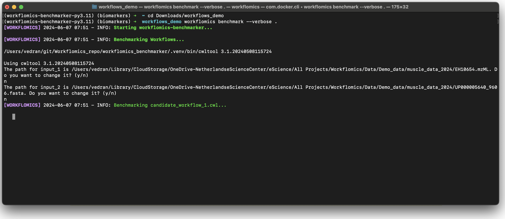

Use Benchmarker
###############

This documentation provides instructions on how to execute and benchmark workflows generated on the Workflomics platform, using the `Workflomics Benchmarker <https://github.com/Workflomics/workflomics-benchmarker>`_ CLI.

If you have not already generated workflows on the Workflomics platform, please refer to the `Workflomics documentation <https://workflomics.readthedocs.io/en/latest/user-guide/web-interface.html>`_ for instructions on generating workflows. 
In addition, please ensure that you have followed the `installation instructions <https://workflomics.readthedocs.io/en/latest/workflomics-benchmarker/benchmarker-installation.html>`_ to install the Workflomics Benchmarker CLI.

Running Workflows
*****************

To run the Workflomics workflows:

1. Make sure that Docker or Singularity is running on your system. 
   
2. Download workflows that were generated on the `Workflomics website <workflomics.org>`_` (using the "Download selected" button, see `documentation <https://workflomics.readthedocs.io/en/latest/user-guide/web-interface.html#explore-generated-workflows>`_), and unzip them.

3. Execute the benchmark command in the terminal to run the workflows relying on Docker containers:

   .. code-block:: bash

      workflomics benchmark <path-to-dir>

   Or to benchmark using Singularity containers, use the following command:

   .. code-block:: bash

      workflomics benchmark <path-to-dir> --singularity

.. note:: Replace <path-to-dir> with the actual path to the directory containing your Workflomics workflows. 

   The benchmarking process will start, and you will see the progress of the workflow executions in the terminal. Once the benchmarking is complete, the results will be saved in a the same directory as the workflows. 
   Computed benchmarks are saved in a file named `benchmarks.json`. In addition, a folder per workflow is created (named `<workflow-name>_outputs`), containing the outputs of the workflow executions.

Command Line Interface (CLI)
============================

The Workflomics Benchmarker CLI provides a set of commands to benchmark and run workflows generated on the Workflomics platform. This section provides an overview of the available commands and their usage.

Get a list of available CLI commands for Workflomics Benchmarker::

  $ workflomics benchmark --help
  $ workflomics run --help

Commands for benchmarking workflows::

  $ workflomics benchmark <path>
  # Benchmark workflows in the specified directory. Use '.' for the current directory.

  $ workflomics benchmark --verbose <path>
  # Display verbose output during benchmarking.

  $ workflomics benchmark --singularity <path>
  # Use Singularity containers for benchmarking instead of Docker.

Commands for running workflows without benchmarking::

  $ workflomics run <path>
  # Run workflows in the specified directory without benchmarking.

.. note:: Make sure to have Docker or Singularity installed and running on your system before running the Workflomics Benchmarker CLI.

The following screenshot shows the command line interface for benchmarking workflows (make):

   Command line interface for benchmarking workflows, showing the start of the benchmarking process.

   Command line interface for benchmarking workflows, showing the CLI output signalizing the completion of the benchmarking process.

Visualizing Benchmark Results
*****************************

After benchmarking, upload your results to the Workflomics platform for interactive visualization:

1. Navigate to the Workflomics Benchmark Upload Page:

   - `Workflomics Benchmarks Upload <http://145.38.190.48/benchmarks>`_

2. Upload your `benchmarks.json` file by following the on-screen instructions.

3. Access interactive visualizations to explore the benchmark results comprehensively.

.. figure:: ../user-guide/screenshots/runtime-benchmarks.png
   :align: center
   :alt: Benchmark results visualization

   Web interface for visualizing benchmark results.

.. note:: Please ensure that any data you upload is free of sensitive or proprietary information, as it will be accessible to other users for analysis and comparison purposes.

